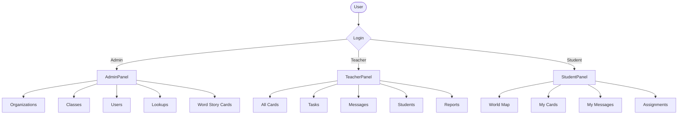
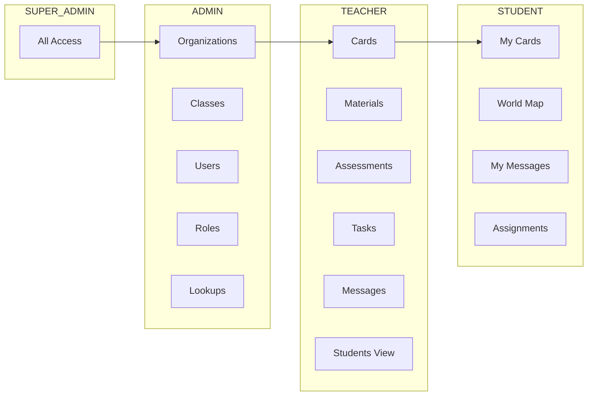

I'll create UI diagrams to help you visualize the application better.

---

# ELODI Platform - UI View Diagrams

## 1. System Overview (User Flow)



---

## 2. Login Page UI

```
┌─────────────────────────────────────────────┐
│                                             │
│              [LOGO]                         │
│                                             │
│            E L O D I                        │
│                                             │
│  ┌─────────────────────────────────────┐   │
│  │                                     │   │
│  │  Email:                             │   │
│  │  ┌─────────────────────────────┐   │   │
│  │  │ teacher@school.com          │   │   │
│  │  └─────────────────────────────┘   │   │
│  │                                     │   │
│  │  Password:                          │   │
│  │  ┌─────────────────────────────┐   │   │
│  │  │ ••••••••                    │   │   │
│  │  └─────────────────────────────┘   │   │
│  │                                     │   │
│  │  [    LOGIN    ]                   │   │
│  │                                     │   │
│  └─────────────────────────────────────┘   │
│                                             │
└─────────────────────────────────────────────┘
```

---

## 3. Admin Dashboard UI

```
┌────────────────────────────────────────────────────────────┐
│ [LOGO] ELODI                              🔔 [👤 Admin]    │
├────────┬───────────────────────────────────────────────────┤
│        │                                                   │
│ HOME   │   Welcome to Dashboard                            │
│        │                                                   │
│ ───────┤   ┌────────────┐  ┌────────────┐  ┌────────────┐ │
│        │   │   50       │  │    10      │  │   200      │ │
│ ──MENU──│   │ Students   │  │ Classes    │  │  Cards     │ │
│        │   └────────────┘  └────────────┘  └────────────┘ │
│ Admin  │                                                   │
│  ├── Organizations  │   Recent Activities                  │
│  ├── Classes        │   • New student added                │
│  ├── Users          │   • Class 5-A created                │
│  ├── Roles          │   • Card published                   │
│  └── Lookups        │                                      │
│                     │   ───────────────────────            │
│ Content             │                                      │
│  ├── Word Story     │   Quick Actions                      │
│  ├── Materials      │   [+ Add User]  [+ Create Card]      │
│  └── Assessments    │                                      │
│                     │                                      │
└─────────────────────┴──────────────────────────────────────┘
```

---

## 4. Student Dashboard UI

```
┌─────────────────────────────────────────────────────────────┐
│ [LOGO]                              🔔 [👤 John Student]    │
├─────────────────────────────────────────────────────────────┤
│                                                             │
│  🌍 WORLD STORY CARDS                    [📍 World Map]    │
│                                                             │
│  ┌──────────────┐  ┌──────────────┐  ┌──────────────┐      │
│  │ 🗼           │  │ 🦁           │  │ 🍎           │      │
│  │              │  │              │  │              │      │
│  │ Eiffel Tower │  │ Lion King    │  │ Apple Tree   │      │
│  │              │  │              │  │              │      │
│  │ ✓ Read       │  │ ✗ Unread     │  │ ◐ In Progress│      │
│  │ ✓ Listened   │  │ ✗ Unlistened │  │ ✓ Listened   │      │
│  │              │  │              │  │              │      │
│  │ [Open Card]  │  │ [Open Card]  │  │ [Open Card]  │      │
│  └──────────────┘  └──────────────┘  └──────────────┘      │
│                                                             │
│  ─────────────────────────────────────────────────────────  │
│                                                             │
│  📚 MY ASSIGNMENTS                                          │
│  ┌─────────────────────────────────────────────────────┐   │
│  │ [📋] Science Project - Due Tomorrow         [View]  │   │
│  │ [📋] Math Quiz - Due in 3 days              [View]  │   │
│  └─────────────────────────────────────────────────────┘   │
│                                                             │
│  💬 MESSAGES                                                │
│  ┌─────────────────────────────────────────────────────┐   │
│  │ [🔊] Teacher: New lesson available!         [Play]  │   │
│  │ [📝] System: Assignment submitted           [Read]  │   │
│  └─────────────────────────────────────────────────────┘   │
│                                                             │
└─────────────────────────────────────────────────────────────┘
```

---

## 5. Word Story Card Detail UI (Student View)

```
┌─────────────────────────────────────────────────────────────┐
│ [← Back] 🗼 THE EIFFEL TOWER                    [Close ✕]   │
├─────────────────────────────────────────────────────────────┤
│                                                             │
│  ┌─────────────────────────────────────────────────────┐   │
│  │                                                     │   │
│  │           [🖼️  LARGE IMAGE OF EIFFEL TOWER]        │   │
│  │                                                     │   │
│  └─────────────────────────────────────────────────────┘   │
│                                                             │
│  Keywords: #France #Paris #Landmark                         │
│                                                             │
│  ┌─────────────┐ ┌─────────────┐ ┌─────────────┐           │
│  │ 📖 READ     │ │ 🔊 LISTEN   │ │ 🎯 QUIZ     │           │
│  │   (Text)    │ │   (Audio)   │ │  (Test)     │           │
│  └─────────────┘ └─────────────┘ └─────────────┘           │
│                                                             │
│  ───── DESCRIPTION ─────────────────────────────────────    │
│                                                             │
│  The Eiffel Tower was built in 1889. It is 330 meters       │
│  tall. It is the most visited paid monument in the world.   │
│                                                             │
│  🎵 [▶️ Play Audio Description]                            │
│                                                             │
│  ───── DIALOG ─────────────────────────────────────────     │
│                                                             │
│  💬 Trip to Paris                                           │
│                                                             │
│  John:  "Wow! Look at that tower!"                         │
│  Sarah: "It's beautiful! Let's go up."                     │
│                                                             │
│  [🔊 Play Dialog]                                          │
│                                                             │
│  ───── EXPLORE MORE ────────────────────────────────────    │
│                                                             │
│  ┌────────┐ ┌────────┐ ┌────────┐                          │
│  │ 🖼️ Pic │ │ 🔊 Snd │ │ 🖼️ Pic │  ← Clickable items     │
│  │ 1889   │ │ Hammer │ │ Night  │     on the card         │
│  └────────┘ └────────┘ └────────┘                          │
│                                                             │
└─────────────────────────────────────────────────────────────┘
```

---

## 6. World Map UI (Student View)

```
┌─────────────────────────────────────────────────────────────┐
│ [← Back] 🌍 WORLD MAP                            [Profile]  │
├─────────────────────────────────────────────────────────────┤
│                                                             │
│                    ┌────────────────────────────────────┐   │
│                    │                                    │   │
│                    │      [🗺️ INTERACTIVE WORLD MAP]   │   │
│                    │                                    │   │
│                    │         🗼 ← Eiffel Tower          │   │
│                    │         (Paris, France)            │   │
│                    │              [2 Cards Available]   │   │
│                    │                                    │   │
│                    │         🦁 ← Lion Reserve          │   │
│                    │         (Kenya, Africa)            │   │
│                    │              [1 Card Available]    │   │
│                    │                                    │   │
│                    │         🗽 ← Statue of Liberty     │   │
│                    │         (New York, USA)            │   │
│                    │              [Completed ✓]         │   │
│                    │                                    │   │
│                    └────────────────────────────────────┘   │
│                                                             │
│  ─────────────────────────────────────────────────────────  │
│                                                             │
│  📍 SELECTED: Paris, France                                 │
│                                                             │
│  Available Cards:                                           │
│  ┌─────────────┐  ┌─────────────┐                          │
│  │ 🗼 Eiffel   │  │ 🥖 French   │                          │
│  │    Tower    │  │   Cuisine   │                          │
│  │ ✓ Completed │  │ ○ New       │                          │
│  │ [View]      │  │ [View]      │                          │
│  └─────────────┘  └─────────────┘                          │
│                                                             │
└─────────────────────────────────────────────────────────────┘
```

---

## 7. Teacher - Create Task UI

```
┌─────────────────────────────────────────────────────────────┐
│ [← Back] CREATE TASK                                         │
├─────────────────────────────────────────────────────────────┤
│                                                             │
│  Task Title:                                                │
│  ┌─────────────────────────────────────────────────────┐   │
│  │ Read Eiffel Tower Card and Answer Questions         │   │
│  └─────────────────────────────────────────────────────┘   │
│                                                             │
│  Description:                                               │
│  ┌─────────────────────────────────────────────────────┐   │
│  │ Please read the card and complete the quiz.         │   │
│  │ Submit before Friday.                               │   │
│  └─────────────────────────────────────────────────────┘   │
│                                                             │
│  Due Date:                                                  │
│  ┌─────────────────┐                                        │
│  │ 2026-03-30      │  [📅]                                  │
│  └─────────────────┘                                        │
│                                                             │
│  Assign To:                                                 │
│  (○) Entire Class    (●) Selected Students                  │
│                                                             │
│  ┌─────────────────────────────────────────────────────┐   │
│  │  ☑️ Class 5-A                                       │   │
│  │     ☐ John (Absent today)                          │   │
│  │     ☑️ Sarah                                        │   │
│  │     ☑️ Mike                                         │   │
│  │     ☑️ Emma                                         │   │
│  │  ☐ Class 5-B                                        │   │
│  └─────────────────────────────────────────────────────┘   │
│                                                             │
│  Attach Card:                                               │
│  ┌─────────────────────────────────────────────────────┐   │
│  │ 🗼 Eiffel Tower                    [Remove ✕]       │   │
│  └─────────────────────────────────────────────────────┘   │
│  [+ Attach Another Card]                                    │
│                                                             │
│                                          [Cancel] [Create]  │
│                                                             │
└─────────────────────────────────────────────────────────────┘
```

---

## 8. Teacher - Message Students UI

```
┌─────────────────────────────────────────────────────────────┐
│ [← Back] SEND MESSAGE                                        │
├─────────────────────────────────────────────────────────────┤
│                                                             │
│  To:                                                        │
│  ┌─────────────────────────────────────────────────────┐   │
│  │ ☑️ Class 5-A Students                                │   │
│  └─────────────────────────────────────────────────────┘   │
│                                                             │
│  Message Title:                                             │
│  ┌─────────────────────────────────────────────────────┐   │
│  │ New Lesson: Eiffel Tower                            │   │
│  └─────────────────────────────────────────────────────┘   │
│                                                             │
│  Message:                                                   │
│  ┌─────────────────────────────────────────────────────┐   │
│  │ Hello students!                                      │   │
│  │                                                      │   │
│  │ A new card is available. Please complete it         │   │
│  │ by Friday.                                          │   │
│  │                                                      │   │
│  │ Good luck!                                          │   │
│  └─────────────────────────────────────────────────────┘   │
│                                                             │
│  🎙️ Record Audio Message:                                   │
│  ┌─────────────────────────────────────────────────────┐   │
│  │ ●────○────────────────────────────  00:15 / 02:00  │   │
│  │ [⏹ Stop] [▶️ Play] [🗑️ Delete]                     │   │
│  └─────────────────────────────────────────────────────┘   │
│  [🎤 Start Recording]                                       │
│                                                             │
│                                          [Cancel] [Send]    │
│                                                             │
└─────────────────────────────────────────────────────────────┘
```

---

## 9. Database Relationship Diagram

```mermaid
erDiagram
    ORGANIZATION ||--o{ CLASS : has
    ORGANIZATION ||--o{ USER : contains
    CLASS ||--o{ USER : enrolls
    USER ||--o{ TASK : assigned_to
    USER ||--o{ MESSAGE : sends
    USER ||--o{ MESSAGE : receives
    USER ||--o{ STUDENT_PROGRESS : tracks
    
    WORD_STORY_CARD ||--o{ CARD_CONTENT : has
    WORD_STORY_CARD ||--o{ QUIZ : contains
    WORD_STORY_CARD ||--o{ MATERIAL : has
    WORD_STORY_CARD ||--o{ TASK : attached_to
    
    ROLE ||--o{ USER : assigns_permissions
    
    LOOKUP ||--o{ LOOKUP_VALUE : has_values
    
    USER {
        int id PK
        string email
        string password
        string name
        UserType userType
    }
    
    ORGANIZATION {
        int id PK
        string name
        int parentId FK
    }
    
    CLASS {
        int id PK
        string name
        int organizationId FK
        int teacherId FK
    }
    
    WORD_STORY_CARD {
        int id PK
        string title
        string keywords
        string description
        string descriptionSound
        CardStatus status
    }
    
    QUIZ {
        int id PK
        int cardId FK
        QuizType type
        string question
        json options
        json correctAnswer
    }
    
    TASK {
        int id PK
        string title
        string description
        DateTime dueDate
        TaskStatus status
    }
    
    MESSAGE {
        int id PK
        string title
        string content
        string audioUrl
        boolean isRead
    }
    
    STUDENT_PROGRESS {
        int id PK
        boolean isRead
        boolean isListened
        boolean completed
        int score
    }
```

---

## 10. User Permission Flow



---

## Quick Reference: What Each User Sees

| User Type | Main Menu Items |
|-----------|----------------|
| **Super Admin** | All features + system settings |
| **Admin** | Organizations, Classes, Users, Roles, Lookups, Cards, Materials, Assessments |
| **Teacher** | All Cards, Tasks, Messages, Students, Reports |
| **Student** | World Map, My Cards, Messages, Assignments |

---

Do you want me to create diagrams for:
1. **Quiz Taking Flow** - How student answers quiz questions?
2. **Card Creation Flow** - How teacher creates a new card?
3. **Progress Tracking** - How system saves student progress?


flowchart TB
    subgraph "STEP 1: Admin Setup"
        A1[👤 Admin Login<br/>admin@college.edu] --> A2[Create Organization]
        A2 --> A3["🏫 Dhaka International College<br/>ID: 1, Name: Dhaka International College"]
        A3 --> A4[Create Class/Batch]
        A4 --> A5["📚 Batch 2024 - Science<br/>ID: 1, OrgID: 1, TeacherID: null"]
        A5 --> A6[Create Lookups]
        A6 --> A7["🔧 Lookups Created:<br/>- Gender: Male, Female, Other<br/>- Blood Group: A+, B+, O+, AB+<br/>- Country: Bangladesh, India, USA"]
    end

    subgraph "STEP 2: Create Users"
        A7 --> B1[Create Teacher User]
        B1 --> B2["👨‍🏫 Mr. Karim<br/>ID: 2, Email: karim@college.edu<br/>Role: TEACHER, OrgID: 1"]
        B2 --> B3[Assign Teacher to Class]
        B3 --> B4["📚 Batch 2024 - Science<br/>Now has Teacher: Mr. Karim"]
        B4 --> B5[Create Student Users]
        B5 --> B6["👩‍🎓 Students Created:<br/>- Rahim (ID: 3)<br/>- Sara (ID: 4)<br/>- Jamil (ID: 5)"]
        B6 --> B7[Enroll Students to Class]
        B7 --> B8["📚 Batch 2024 - Science<br/>Students: Rahim, Sara, Jamil"]
    end

    subgraph "STEP 3: Teacher Creates Content"
        B8 --> C1[👨‍🏫 Teacher Login<br/>karim@college.edu]
        C1 --> C2[Create Word Story Card]
        C2 --> C3["🗼 Eiffel Tower Card<br/>ID: 1, Status: DRAFT"]
        C3 --> C4[Add Quiz to Card]
        C4 --> C5["📝 Quiz Created:<br/>Q: When was Eiffel Tower built?<br/>A: 1889, Points: 10"]
        C5 --> C6[Publish Card]
        C6 --> C7["🗼 Eiffel Tower Card<br/>Status: PUBLISHED<br/>Students can now see it"]
    end

    subgraph "STEP 4: Teacher Manages Tasks"
        C7 --> D1[Create Task]
        D1 --> D2["📋 Task: Read Eiffel Tower Card<br/>ID: 1, Due: 2026-03-30"]
        D2 --> D3[Assign to Students]
        D3 --> D4["📋 Task Assigned to:<br/>- Rahim<br/>- Sara<br/>- Jamil"]
    end

    subgraph "STEP 5: Teacher Sends Message"
        D4 --> E1[Create Message]
        E1 --> E2["💬 Message: New Lesson Available!<br/>ID: 1, Audio: lesson.mp3"]
        E2 --> E3[Send to Class]
        E3 --> E4["💬 Message Sent to:<br/>Batch 2024 - Science<br/>All 3 students receive it"]
    end

    subgraph "STEP 6: Student Activity"
        E4 --> F1[👩‍🎓 Student Login<br/>rahim@college.edu]
        F1 --> F2[View Dashboard]
        F2 --> F3["📊 Student Sees:<br/>- 🗼 Eiffel Tower Card (New)<br/>- 📋 Task: Read Card (Due Tomorrow)<br/>- 💬 Message: New Lesson! (Unread)"]
        F3 --> F4[Open Card]
        F4 --> F5["🗼 Eiffel Tower Card<br/>Click: 📖 Read, 🔊 Listen, 🎯 Quiz"]
        F5 --> F6[Take Quiz]
        F6 --> F7["🎯 Quiz Score: 10/10<br/>✓ Completed"]
        F7 --> F8[Play Audio Message]
        F8 --> F9["🔊 Audio: 'Hello students...'<br/>✓ Message Read"]
    end

    subgraph "STEP 7: Progress Tracking"
        F9 --> G1[System Saves Progress]
        G1 --> G2["📊 StudentProgress Record:<br/>StudentID: 3 (Rahim)<br/>CardID: 1, isRead: true<br/>isListened: true, Score: 100%"]
        G2 --> G3[Teacher Views Report]
        G3 --> G4["📈 Teacher Sees:<br/>Rahim: ✓ Completed<br/>Sara: ◐ In Progress<br/>Jamil: ✗ Not Started"]
    end

    style A1 fill:#e1f5ff
    style A3 fill:#d4edda
    style B2 fill:#fff3cd
    style C1 fill:#ffeeba
    style C7 fill:#d4edda
    style F1 fill:#f8d7da
    style F7 fill:#d4edda
    style G4 fill:#cce5ff
